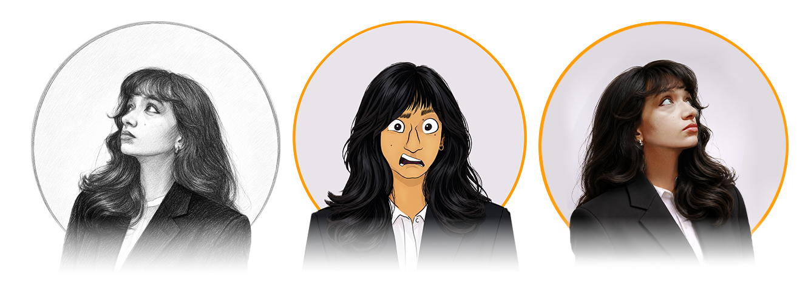

# Hi there, I'm Preethi (Bhat) Parpakaje!

I'm an **Interdisciplinary Artist, Creative Technologist, and Graphics / VFX Generalist** who enjoys working at the intersection of art, technology, design, and storytelling.

I move between physical and digital mediums — from carving wood and stone to building digital experiences, creating VFX, designing interfaces, and developing creative tools.

> **"Learn any of the four skills; you can create the fifth one."**

## About Me 🚀

I'm a multidisciplinary artist and creative technologist with experience across **3D & VFX, motion design, UI/UX, illustration, physical sculpture, filmmaking, and creative technology**.

I enjoy tackling problems from multiple perspectives and bringing together seemingly unrelated disciplines to create something new.

- 🎨 **Interdisciplinary Artist** — Sculpture, illustration, storyboard, production design & visual storytelling
- 💻 **Creative Technologist** — Houdini, Blender, Python, UI tools & digital workflows
- 🎬 **Graphics / VFX Generalist** — 3D, compositing, motion graphics & video
- 🌱 Currently exploring: **Creative coding, procedural workflows, Houdini tool development & digital pipelines**
- 🔭 Working on: **Creative technology tools, VFX workflows and interdisciplinary design projects**
- 🌍 Languages: **Kannada, English, Hindi, Sanskrit**
- 📫 How to reach me: **preethibhatp@gmail.com**
- ⚡ Fun fact: **I believe learning four different skills can lead you to a fifth skill that belongs entirely to you.**

## My Skills 🧠

### 🎨 Design & Visual Arts

&logoColor=white)

**Illustration • Graphic Design • Branding • UI Design • Storyboarding • Concept Development**

### 🧊 3D & VFX

**Procedural 3D • VFX • Look Development • Digital Sculpting • 3D Workflows**

### 🎬 Motion & Post-Production

**Motion Graphics • Video Editing • Animation • Compositing • Stop-Motion**

### 🧑‍💻 Creative Technology

**Creative Coding • Houdini Tool Development • Procedural Workflows • UI Tools • Pipeline Development**

### 🖥️ Web & UI

**UI Design • Wireframing • UX Research • Creative Interfaces**

## Featured Projects 💻

### VEXiL — Houdini Project Management & Pipeline Tool

**VEXiL** is a Houdini-integrated project management and pipeline tool designed to bring **project organization, scene management, versioning, asset management and workflow tracking** directly into the artist's environment.

The project explores how production workflows can be made more efficient without forcing artists to constantly switch between their creative software and external management systems.

**Focus areas:**

- Houdini integration
- Project & scene management
- Incremental versioning
- Asset and path management
- PySide6 interfaces
- SQLite / SQLAlchemy
- Procedural pipeline development
- USD / Solaris workflows

🔗 It is a WIP

### 777 Charlie — Storyboard & Stop-Motion

**777 Charlie** involved visual storytelling through **storyboarding and stop-motion animation**, combining traditional visual planning with physical production techniques.

This project reflects my interest in storytelling that moves between **illustration, physical media, animation and filmmaking**.

**Skills demonstrated:**

- Storyboarding
- Visual storytelling
- Stop-motion
- Production planning
- Character & scene development

🔗 [Watch the Storyboard Project](https://www.youtube.com/watch?v=lUBqkzbIAVY)

### Made in Bengaluru — Art Department & Visual Development

**Made in Bengaluru** involved working within the **art department and visual development process**, contributing to the creation of the visual language and physical world of the project.

The experience brought together my interests in **production design, visual research, physical environments and filmmaking**.

**Skills demonstrated:**

- Art direction
- Production design
- Visual development
- Set design
- Creative collaboration

🔗 [Watch the Project](https://www.youtube.com/watch?v=G7C7oQG5Qts)

## What I Do 🎯

### Immersive & Technology

- VR / Fulldome
- 2D-to-3D conversion
- 3D anatomical sculpting
- UI / UX design
- Creative technology

### Film & Motion

- Storyboarding
- Stop-motion animation
- Motion graphics
- Video editing
- Art department / production design
- VFX

### Physical Studio

- Wood sculpture
- Stone sculpture
- Terracotta sculpture
- Mural painting
- Set design

### Narrative Art

- Illustration
- Comic art
- Portraiture
- Poetry
- Visual storytelling
- Social media graphics

## My Approach 🧩

I don't like keeping disciplines in separate boxes.

A sculpture can teach me about **form**.

A film can teach me about **composition and timing**.

Houdini can teach me about **systems and procedural thinking**.

Design can teach me about **communication**.

And programming can teach me to **build tools around creative problems**.

The interesting work happens where these disciplines overlap.

## Experience 💼

**Graphics & VFX Generalist / Project Coordinator**  
*Morpheus Plus Dreamscapes Media LLP*  
`2023 – Present`

**Animation & Design Consultant**  
*Co&Co*  
`2023`

**Part-Time Graphic Designer**  
*Hammer Mindset*  
`2021 – 2025`

**Freelance Creative Content Creator / Brand Warrior**  
*Sudhee Networks Pvt Ltd • Raospacе • User Umbrella*  
`2021 – 2025`

**Software Skills, Animation & Design Lecturer**  
*College of Fine Arts*  
`2022 – 2023`

**Senior Concept Artist / Design Lead**  
*Visual Connections Pvt Ltd*  
`2019 – 2022`

**Creative Design Intern**  
*Spring Designs*  
`2019`

## Education 🎓

**Bachelor of Visual Arts — Applied Arts**  
Alva's Education Foundation  
`2015 – 2019`

**PUC — Science (PCMB)**  
SSPU College  
`2013 – 2015`

## Professional Highlights ✨

- 🎬 Worked across film and entertainment projects including **777 Charlie** and **Made in Bengaluru**
- 🌐 Worked on immersive / fulldome experiences
- 🎨 Cross-disciplinary experience across art, design and technology
- 👥 Project coordination, client management and team leadership
- 🧑‍🏫 Teaching experience in software, animation and design
- 🚀 Interested in building creative tools and improving digital production workflows

## Get in Touch 📬

- 🌐 **Website:** [preethi.works](https://preethi.works)
- 💼 **LinkedIn:** [Preethi Parpakaje](https://www.linkedin.com/in/preethi-parpakaje-4a3a33a8/)
- 📸 **Instagram:** [@preethibhat_digiartist](https://www.instagram.com/preethibhat_digiartist/)
- 📧 **Email:** preethibhatp@gmail.com

### "Learn any of the four skills; you can create the fifth one."

**Artist • Technologist • Designer • Storyteller**

